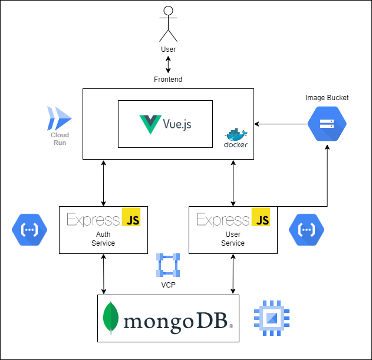

# Aufi

### Integrantes:

- Victor Ostolaza
- Macarena Oyague

---

## Descripción del proyecto

Aufi es una aplicación web que se encarga de ser el guardarropa virtual de los usuarios. Los usuarios podrán digitalizar sus prendas (tops, bottoms, footwear y accesorios) con la finalidad de poder armar combinaciones diferentes a partir de las prendas que tiene. Para ello, podrán guardar combinaciones con etiquetas de acuerdo a la situaciones en las que usarían el conjunto (oficina, casual, elegante).

## Requerimientos

### Funcionales

- Los usuarios podrán crear una cuenta asociada a su correo.
- Los usuarios podrán acceder a su cuenta desde diferentes dispositivos.
- Los usuarios podrán subir imágenes de sus distintas prendas y asociarlas a un tipo de prenda (tops, bottoms, footwear y accesorios).
- Los usuarios podrán guardar conjuntos conformados por combinaciones de distintos tipos de prendas (uno por tipo).
- Los usuarios podrán asignar etiquetas a sus conjuntos para describir en que ocasión los usuarían.
- Los usuarios podrán pedir, a partir de las etiquetas asignadas, un conjunto que haya sido anteriormente guardado.

### No funcionales

- Las imágenes serán subidas y almacenadas en un `Bucket` de `Google Cloud Platform`.
- Las contraseñas de los usuarios serán hasheadas con salt para asegurar la seguridad de los usuarios.
- La base de datos utilizará un motor de `MongoDB` hosteada en `GCP`.
- Los servicios de autenticación para registro e inicio de sesión se manejaran de manera `serverless` a través de un `Cloud Function`.
- Los servicios de usuario se manejarán de manera `serverless` a través de un `Cloud Function`.
- El `front-end` será desplegado en un contenedor a `Cloud Run`, un `PaaS` que se encargará de gestionar la infraestructura.

## Arquitectura Propuesta



## Tópicos de cloud a utilizar

### Function as a Service (FaaS)

Nuestros servicios de backend estarán desplegados en `Cloud Functions`, la solucón de `FaaS` de `GCP`. Esto nos permite trabajar de una manera `serverless` lo que nos da más flexibilidad de `escalabilidad`.

### Platform as a Service (PaaS)

Nuestro `front-end` será desplegado dentro de un `container` a `Cloud Run`, la solución de `PaaS` de `GCP`, esto nos permitirá enfocarnos en nuestra aplicación, mientras que los recursos son gestionados por la plataforma.

### Containers

Para asegurar que no nos topemos con problemas por diferencias en el ambiente de desarrollo y en el productivo, desplegaremos nuestro `front-end` en un contenedor de `Docker`.

---

## Documentación

## Base de datos

```js
User = {
  username: String,
  password: String,
  tops: [String],
  bottoms: [String],
  footwear: [String],
  accessories: [String],
  outfits: [Outfit],
};

Outfit = {
  top: String,
  bottom: String,
  footwear: String,
  accessory: String,
  tag: String,
};
```

### Rutas Frontend

- `/`: índice con las funcionalidades de la webpage
- `/register`: registro con username y pwd
- `/login`: inicio de sesión con username y pwd
- `/subir-prenda`: upload de archivo con una imagen asociado a una categoría
- `/arma-tu-aufi`: selección de un conjunto asociado a un tag
- `/random-aufi`: retorno de un conjunto previamente almacenado en arma-tu-aufi

### Endpoints Backend

#### User service:
- [GET] `/userService/user/<username>` Retorna información de usuario (prendas y conjuntos)
- [POST] `/userService/uploadClothing`
  - ```json
      {
        "url" : string,
        "tag" : string,
      }
    ```